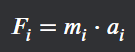
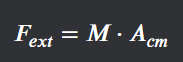

# Dynamics of Systems of Particles

## Introduction

Dynamics of systems of particles is a fundamental concept in classical mechanics that deals with the motion of multiple interacting particles. This branch of physics is crucial for understanding complex systems ranging from molecular interactions to celestial mechanics.

## Key Concepts

1. **System of Particles**: A collection of discrete particles that interact with each other and with external forces.

2. **Center of Mass**: The average position of mass in a system, calculated as the weighted average of the positions of all particles.

3. **Linear Momentum**: The product of mass and velocity for each particle, summed over all particles in the system.

4. **Angular Momentum**: A measure of rotational motion, calculated as the cross product of position and linear momentum for each particle, summed over all particles.

5. **Kinetic Energy**: The energy associated with the motion of particles, calculated as the sum of 1/2 mv^2 for each particle.

6. **Internal and External Forces**: Forces between particles within the system (internal) and forces acting on the system from outside (external).

## Equations of Motion

The motion of a system of particles can be described using Newton's Second Law applied to each particle:

F_i = m_i * a_i

((Net Force on Particle i) = (Mass of Particle i) * (Acceleration of Particle i))

Where F_i is the net force on particle i, m_i is its mass, and a_i is its acceleration.

## Center of Mass Motion

The motion of the center of mass (CM) of a system of particles follows:

F_ext = M * A_cm

((External Force) = (Total Mass) * (Acceleration of Center of Mass))

Where F_ext is the sum of all external forces, M is the total mass of the system, and A_cm is the acceleration of the center of mass.

## Conservation Laws

1. **Conservation of Linear Momentum**: In the absence of external forces, the total linear momentum of a system remains constant.

2. **Conservation of Angular Momentum**: If the net external torque on a system is zero, the total angular momentum is conserved.

3. **Conservation of Energy**: In a closed system, the total energy (kinetic + potential) remains constant.

## Example Problem

Consider a system of two particles with masses m1 = 2 kg and m2 = 3 kg, initially at rest. An impulse J = 10 N·s is applied to m1. Find the velocity of the center of mass after the impulse.

Solution:
TODO: Add solution

The center of mass moves at 2 m/s in the direction of the applied impulse.

## Applications

1. **Rocket Propulsion**: Understanding the dynamics of exhaust particles helps in designing efficient propulsion systems.

2. **Molecular Dynamics**: Simulating the behavior of complex molecules and materials.

3. **Astrophysics**: Modeling the behavior of star clusters and galaxies.

4. **Particle Physics**: Analyzing collision experiments in particle accelerators.

## Conclusion

The dynamics of systems of particles provides a powerful framework for understanding complex physical systems. By applying conservation laws and equations of motion to multiple interacting particles, we can predict and explain a wide range of phenomena in nature and engineering.

This topic forms the foundation for more advanced concepts in classical mechanics, such as rigid body dynamics and continuum mechanics. It also plays a crucial role in connecting microscopic particle behavior to macroscopic observable properties in statistical mechanics and thermodynamics.