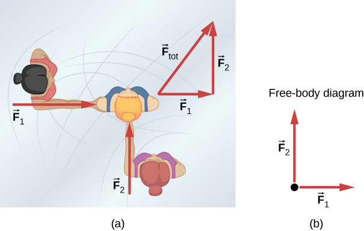

# Free-Body Diagrams

## Introduction



"Figure 5.3 (a) An overhead view of two ice skaters pushing on a third skater. Forces are vectors and add like other vectors, so the total force on the third skater is in the direction shown. (b) A free-body diagram representing the forces acting on the third skater."

Image Source [here](https://openstax.org/books/university-physics-volume-1/pages/5-1-forces?query=Free-body%20diagram&target=%7B%22index%22%3A0%2C%22type%22%3A%22search%22%7D#CNX_UPhysics_05_01_IceSkaters)

A free-body diagram (FBD) is a pictorial representation of an object and all the external forces acting upon it. It's a crucial tool in physics for analyzing force problems and applying Newton's laws of motion. Mastering the creation and interpretation of free-body diagrams is essential for solving a wide range of mechanics problems.

## Purpose of Free-Body Diagrams

1. Visualize all forces acting on an object
2. Simplify complex physical situations
3. Aid in setting up equations for problem-solving
4. Help identify action-reaction pairs

## Components of a Free-Body Diagram

1. The object of interest, usually represented as a point or a simple shape
2. Arrows representing forces, with:
    - Length proportional to the magnitude of the force
    - Direction indicating the direction of the force
3. Labels for each force
4. Coordinate axes (when relevant)

## Steps to Create a Free-Body Diagram

1. Isolate the object of interest
2. Draw a simple shape to represent the object
3. Identify all external forces acting on the object
4. Draw arrows representing each force
5. Label each force
6. Add coordinate axes if needed

## Types of Forces Commonly Seen in Free-Body Diagrams

1. Weight (W or mg): Always points downward
2. Normal force (N): Perpendicular to the surface of contact
3. Friction (f): Parallel to the surface of contact, opposes motion
4. Tension (T): Along the direction of a rope or string
5. Applied forces (F): In the direction of application
6. Spring force (Fs): Along the axis of the spring

## Common Scenarios and Their Free-Body Diagrams

### 1. Object on a Flat Surface

```
      N
      ^
      |
    --|--
   |     |
   |  *  |
   |_____|
      |
      v
      W
```

Forces: Normal force (N), Weight (W)
If moving or about to move: add Friction (f) and Applied Force (F)

### 2. Object on an Inclined Plane

```
     N
      \
    |  \
 W  |   \  f
 |  |    \
 | \|     \
 |  *----->F
 |         \
 v          \
```

Forces: Normal force (N), Weight (W), Friction (f), possibly Applied Force (F)

### 3. Two Objects Connected by a String

```
   T    T
<----*---->*
     m1    m2
     |     |
     v     v
     W1    W2
```

Forces: Tension (T), Weights (W1, W2)

## Example Problem: Block on an Inclined Plane

A 5 kg block rests on a 30° inclined plane. The coefficient of static friction is 0.3. Determine if the block will slide down the plane.

Step 1: Draw the free-body diagram

```
     N
      \
    |  \
 W  |   \  f
 |  |    \
 | \|     \
 |  *      \
 |          \
 v           \
```

Step 2: Identify and label forces

-   Weight (W)
-   Normal force (N)
-   Friction force (f)

Step 3: Break down the weight vector

-   W_parallel = W sin(30°) = mg sin(30°)
-   W_perpendicular = W cos(30°) = mg cos(30°)

Step 4: Apply Newton's Second Law

-   Along the plane: f = W sin(30°) for equilibrium
-   Perpendicular to the plane: N = W cos(30°)

Step 5: Check if maximum static friction is exceeded

-   f_max = μN = μmg cos(30°)
-   f_max = 0.3 _ 5 kg _ 9.8 m/s² \* cos(30°) = 12.74 N
-   W sin(30°) = 5 kg _ 9.8 m/s² _ sin(30°) = 24.5 N

Since W sin(30°) > f_max, the block will slide down the plane.

## Common Mistakes in Creating Free-Body Diagrams

1. Including internal forces
2. Omitting forces
3. Incorrect force directions
4. Inconsistent scale for force arrows
5. Forgetting to break down forces on inclined planes

## Applications of Free-Body Diagrams

1. Analyzing static equilibrium problems
2. Solving dynamics problems with Newton's Second Law
3. Understanding complex systems like pulleys and connected objects
4. Analyzing forces in structures and machines

## Practice Problems

1. Draw a free-body diagram for a book resting on a table. Then, draw a new diagram showing what changes if the table is accelerating to the right.

2. Create a free-body diagram for a person standing in an elevator that is accelerating upward.

3. Draw a free-body diagram for a car rounding a banked curve at constant speed. Assume the banking angle is sufficient to prevent sliding.

4. Two masses m1 = 2 kg and m2 = 3 kg are connected by a light string over a frictionless pulley. Draw free-body diagrams for each mass and use them to set up equations to solve for the system's acceleration.

5. A block is placed on a wedge, which is resting on a table. The wedge is then slowly pulled horizontally. Draw free-body diagrams for both the block and the wedge.
